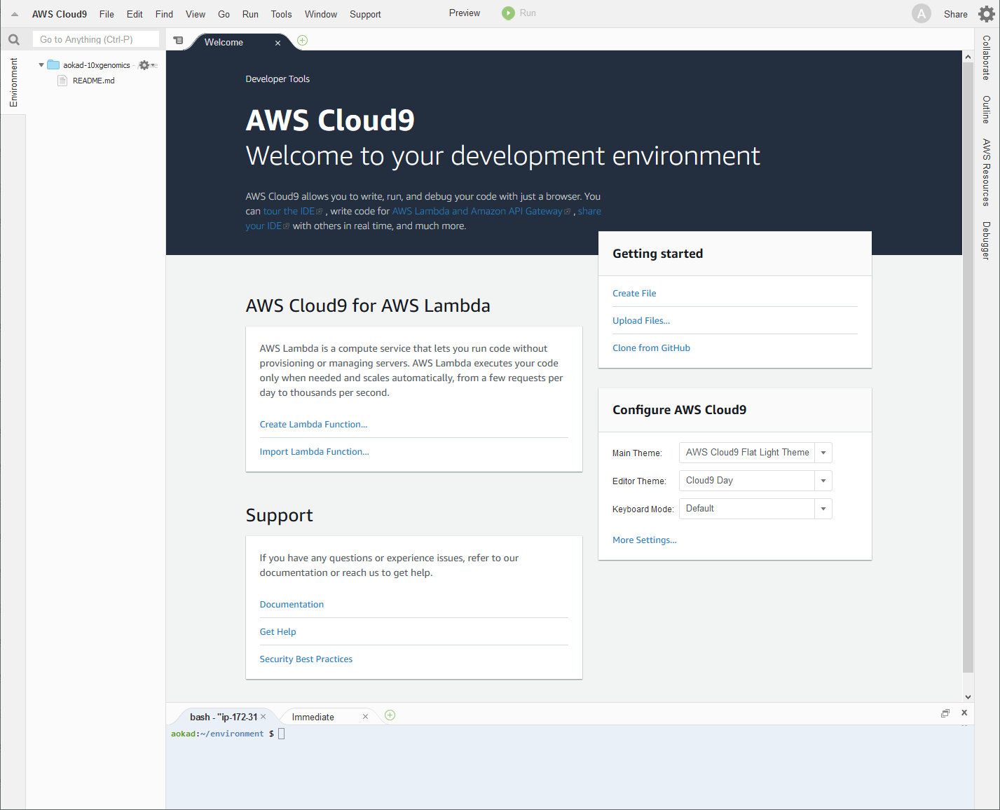
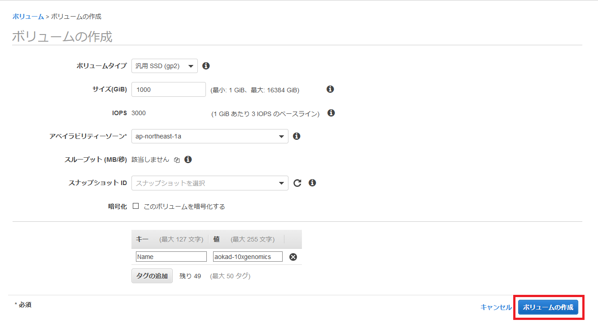
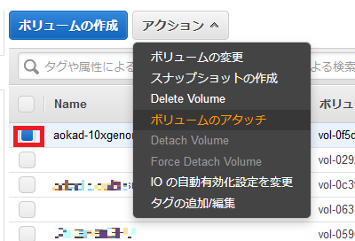

2019.7.31　作成　NCC

# AWS Cloud9 を使用して Linux サーバを構築する

## 1. AWS コンソールにログイン

https://aws.amazon.com を web ブラウザで開き、「コンソールにサインイン」をクリックします。


次の画面でアカウント、ユーザ名、パスワードを入力します。


AWS マネジメントコンソールで東京リージョンを選択しておきます。


## 2. EC2 インスタンスの起動

AWS マネジメントコンソールで Cloud9 サービスを選択します。


「Create environment」をクリックします。


まず作成する cloud9 環境に名前を付けます。  
「Name」に名前 (任意の英数字) を入力し、「Next step」をクリックします。


次に cloud9 環境の設定を以下内容で設定してください。  

 - Environment type: "Create a new instance for environment (EC2)" 
 - Instance type: "Other instance type" にチェックをつけて、"t3.2xlarge" を選択
 - Platform: "Amazon Linux"
 - Cost-saving setting: "After 30 minutes (Default)

入力出来たら、ページの最後にある「Next step」をクリックします。


確認画面が表示されますので、問題なければ「Create environment」をクリックしてください。


作成が開始されますので、黒い画面が消えるまで待ちます。


このような画面が表示されれば使用可能です。



## 3. ボリュームの追加

今回は 1T のボリュームが必要ですので、追加でボリュームを作成します。

AWS マネジメントコンソールで EC2 サービスを選択します。


EC2 ダッシュボードが表示されますので、左端のメニューから「ボリューム」を選択し、「ボリュームの作成」ボタンを押します。


以下内容で設定してください。  
それ以外の項目はデフォルトのままで構いません。

 - ボリュームタイプ: gp2
 - サイズ (GiB): 1000
 - キー: 「タグの追加」を押して行を追加した後、キーに「Name」、値に名前 (任意の英数字) を入力します

入力出来たら、「ボリュームの作成」ボタンを押します。



「閉じる」ボタンを押します。


作成したボリュームは「available」になっています。


次に作成したボリュームを cloud9 環境にアタッチします。

作成したボリュームを選択した後、「アクション」→「ボリュームのアタッチ」の順にクリックします。



ボリュームのアタッチするインスタンスを選択します。  
cloud9 で作成したインスタンスには "aws-cloud9-{自分で設定したcloud9の名前}-{英数字}" という名前が付けられています。


アタッチ先が "/dev/sdf" であることを確認して、「アタッチ」ボタンを押します。


状態が「available」から「in-use」になれば成功です。


## 4. work ディレクトリの準備

ここからは作成した cloud9 でコマンドを実行します。  
黄色で囲った部分がターミナルです。


まず、アタッチしたディスクが存在するかを確認します。

```Bash
$ ls /dev/sdf
/dev/sdf
```

フォーマットします。

```Bash
$ sudo mkfs -t ext4 /dev/sdf
mke2fs 1.43.5 (04-Aug-2017)
Creating filesystem with 262144000 4k blocks and 65536000 inodes
Filesystem UUID: 6e3c88af-05e2-4350-935e-6dd91301a047
Superblock backups stored on blocks: 
        32768, 98304, 163840, 229376, 294912, 819200, 884736, 1605632, 2654208, 
        4096000, 7962624, 11239424, 20480000, 23887872, 71663616, 78675968, 
        102400000, 214990848

Allocating group tables: done                            
Writing inode tables: done                            
Creating journal (262144 blocks): done
Writing superblocks and filesystem accounting information: done     
```

work ディレクトリにマウントします。

```Bash
$ sudo mkdir /work
$ sudo mount /dev/sdf /work
$ df -h
Filesystem      Size  Used Avail Use% Mounted on
devtmpfs         16G   60K   16G   1% /dev
tmpfs            16G     0   16G   0% /dev/shm
/dev/nvme0n1p1  9.8G  5.7G  4.0G  60% /
/dev/nvme1n1    984G   77M  934G   1% /work
```

work ディレクトリのパーミッションを変更します。

```Bash
$ touch /work/file1
touch: cannot touch ‘/work/file1’: Permission denied
$ whoami
ec2-user
$ sudo chown ec2-user /work
$ touch /work/file1
$ ls -l /work
total 16
-rw-rw-r-- 1 ec2-user ec2-user     0 Jul 31 06:51 file1
drwx------ 2 root     root     16384 Jul 31 06:50 lost+found
```

## 3. 片付け

### 3.1 終了する

ブラウザを閉じるだけでよいです。  
AWS Cloud9 の環境はデフォルト設定で、30分無操作で停止状態になります。


### 3.2 cloud9 の環境を削除する

必要のない場合は削除します。

AWS マネジメントコンソールから cloud9 サービスを選択し、作成した環境を選択した後、「Delete」をクリックします。


確認画面が表示されますので、削除したい環境を十分に確認したらテキストボックスに「Delete」と入力した後、「Delete」ボタンを押します。


アタッチしたボリュームを削除します。  

AWS マネジメントコンソールから ec2 サービスを選択し、左端のメニューから「ボリューム」を選択し、ボリュームを表示します。  
今回作成したボリュームを選択した後、「アクション」→「Delete Volume」をクリックします。


確認画面が表示されますので、内容を確認したら、「はい、削除する」ボタンを押します。


