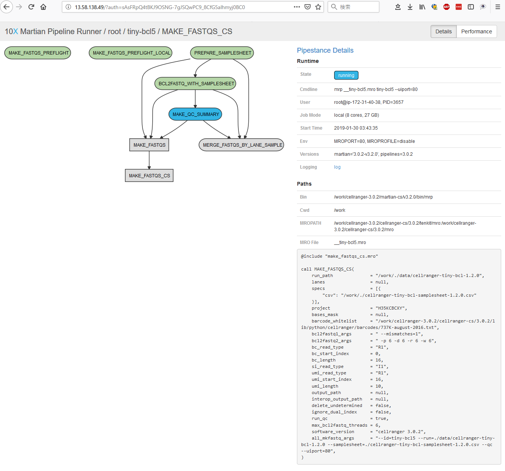

2019.7.31　作成　NCC

## Option. Cell Ranger ユーザインタフェースの利用

cellranger パイプラインにはユーザインターフェールが用意されています。  

公式ドキュメント：[The Cell Ranger User Interface](https://support.10xgenomics.com/single-cell-gene-expression/software/pipelines/latest/advanced/ui)

公開ポートはランダムなため、 `--uiport=80` をつけて80番固定することができます。  
ユーザインターフェースの場所は実行ログに記載されています。

```
$ cellranger mkfastq --id=tiny-bcl5 --run=./data/cellranger-tiny-bcl-1.2.0 --samplesheet=./cellranger-tiny-bcl-samplesheet-1.2.0.csv --qc --uiport=80
/work/cellranger-3.0.2/cellranger-cs/3.0.2/bin
cellranger mkfastq (3.0.2)
Copyright (c) 2019 10x Genomics, Inc.  All rights reserved.
-------------------------------------------------------------------------------

Martian Runtime - '3.0.2-v3.2.0'
Serving UI at http://ip-172-31-40-38:80?auth=sAsFRDQ4tBKJ9OGNG-7gJSWwPC9_8CfG3alhmyj0BC0 # <- ★ここ

Running preflight checks (please wait)...
（以下省略）
```

AWS インスタンスを使用していると、デフォルトで内部ネットワークアドレスが表示されていますので、外部ネットワークアドレスに読み直してアクセスします。

インスタンスの外部ネットワークアドレスは以下のようにして取得することができます。

AWS マネジメントコンソールから ec2 サービスを選択します。  
左端のメニューから「インスタンス」を選択した後、目的のインスタンスを選択します。  
右下にインスタンスの情報が記載されていますので、そこから「IPv4 パブリック IP」を探します。  
なお、内部ネットワークアドレスは「プライベート IP」という名前で記載されています。


外部ネットワークアドレスに読み替えるとユーザインターフェースの URL は以下のようになります。

http://13.58.138.49:80?auth=sAsFRDQ4tBKJ9OGNG-7gJSWwPC9_8CfG3alhmyj0BC0

ブラウザで開くと以下のような画面が表示されます。



より詳しい解説は [The Cell Ranger User Interface](https://support.10xgenomics.com/single-cell-gene-expression/software/pipelines/latest/advanced/ui) を参照してください。

---

以上です。
