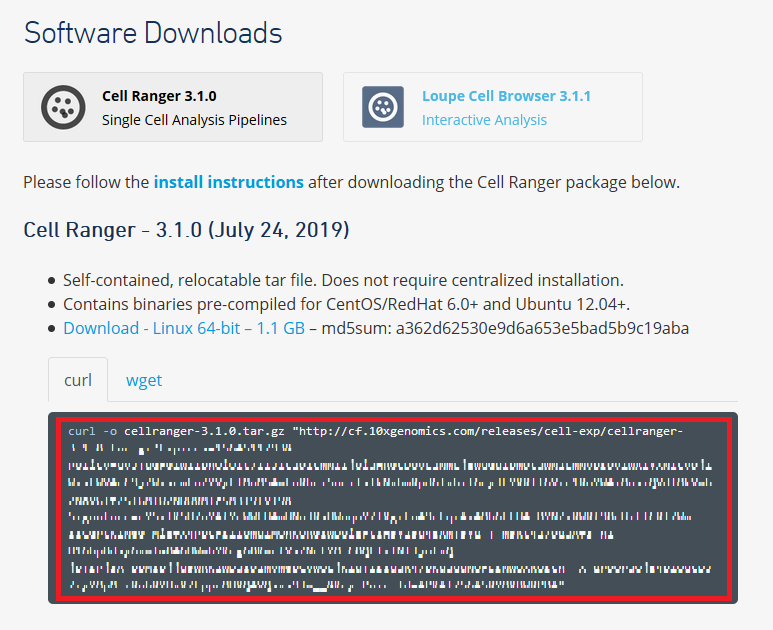
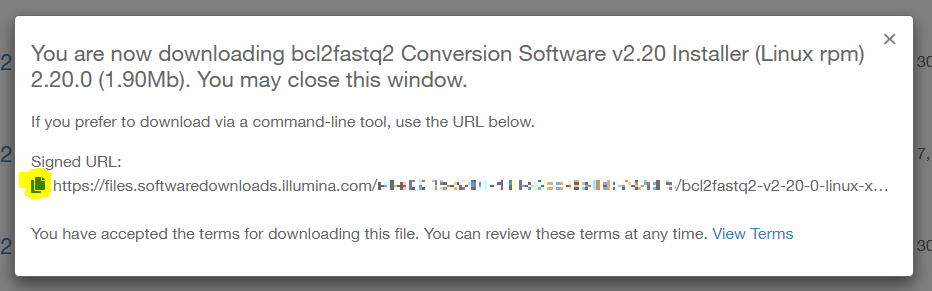

Cell Ranger のインストール
-----------------------------

公式ドキュメント： `Cell Ranger Installation <https://support.10xgenomics.com/single-cell-gene-expression/software/pipelines/latest/installation>`__

AWS EC2 インスタンスを起動
~~~~~~~~~~~~~~~~~~~~~~~~~~~~~~~

AWS コンソールにログインし、EC2 インスタンスを起動します。

Cell Ranger を使用するには以下の `システム要件 <https://support.10xgenomics.com/single-cell-gene-expression/software/overview/system-requirements>`__ が提示されていますので、1TByte のディスクストレージ (gp2) をつけてインスタンスタイプ m5.4xlarge を選択します。

::

    System Requirements
     - 8-core Intel
     - 64GB RAM
     - 1TB free disk space
     - 64-bit CentOS/RedHat 6.0 or Ubuntu 12.04

| セキュリティグループではポート 22 番を開けておいてください。
| その他の設定はデフォルトのままで構いません。
|
| EC2 インスタンスを起動したら、 SSH ログインし、アタッチしたストレージを初期化して /work ディレクトリにマウントしておきます。
| 実際に使用する場合はマウント先のディレクトリ名はなんでも構いませんが、ここでは解説の記載に合わせて /work ディレクトリとしておきます。

.. code:: bash

    mkfs -t ext4 /dev/sdb
    mkdir /work
    mount /dev/sdb /work
    cd /work

ターミナルはこのまま使いますので、ログインしたままにしておいてください。

詳細な手順は以下を参照してください。

 - `AWS Cloud9 を利用する場合 <./aws_cloud9.html>`__
 - `AWS EC2 を利用する場合 <./aws_ec2.html>`__

Cell Ranger をダウンロード
~~~~~~~~~~~~~~~~~~~~~~~~~~~~~~~

| Cell Rangerは tar ファイルとして公開されています。
| 必要なソフトウェアの依存関係をすべてまとめたもので、さまざまな Linux ディストリビューションで動作するように事前にコンパイルされていますので、インストールはこのファイルをダウンロードして解凍するだけです。
| 
| まず、 `このページ <https://support.10xgenomics.com/single-cell-gene-expression/software/downloads/latest>`__ にアクセスし、「10x Genomics End User Software License Agreement」を確認して必要事項を入力した後、「Continue to Downloads」ボタンをクリックします。
| 
| 「Continue to Downloads」ボタンをクリックすると、次のような画面が表示されます。
| 赤枠の中がダウンロードコマンドですので、すべて選択して、先ほどログインしたターミナルに張り付けて実行します。

|image0|

.. code:: bash

    cd /work
    curl -o cellranger-3.1.0.tar.gz "http://cf.10xgenomics.com/releases/cell-exp/cellranger-3.1.0.tar.gz?{コピーしたコマンド}"

| ダウンロードしたファイルを解凍します。
| ファイル名のバージョンはダウンロードしたファイルに合わせてください。

.. code:: bash

    tar -xzvf cellranger-3.1.0.tar.gz

リファレンスファイルの準備
~~~~~~~~~~~~~~~~~~~~~~~~~~~~~~~

| `1-2 <#id1>`__ で開いたダウンロード画面の下にリファレンスのダウンロードコマンドも表示されています。
| 赤枠の中をすべて選択して、ターミナルに張り付けて実行します。

|image1|

.. code:: bash

    curl -O http://cf.10xgenomics.com/supp/cell-exp/{コピーしたコマンド}

ダウンロードに約4～5分かかります。

| `1-2 <#id1>`__ と同様にダウンロードしたファイルを解凍します。
| ファイル名のバージョンはダウンロードしたファイルに合わせてください。

.. code:: bash

    tar -xzvf refdata-cellranger-GRCh38-and-mm10-3.1.0.tar.gz

Cell Ranger にパスを通す
~~~~~~~~~~~~~~~~~~~~~~~~~~~~~

解凍した cellranger-3.1.0 ディレクトリを PATH に追加します。これで cellranger パイプラインを実行することができます。

.. code:: bash

    export PATH=/work/cellranger-3.1.0:$PATH

インストールの確認
~~~~~~~~~~~~~~~~~~~~~~~

cellranger パイプラインが正しくインストールされていることを確認するために cellranger testrun を実行します。  
約 8～10 分かかります。

.. code:: bash

    cellranger testrun --id=tiny

次のように表示されれば成功です。

::

    Pipestance completed successfully!
    
    2019-11-26 09:18:10 Shutting down.
    Saving pipestance info to "tiny/tiny.mri.tgz"

パイプラインの実行結果は成否にかかわらず tiny/tiny.mri.tgz に出力されています。

bcl2fastq をインストール
~~~~~~~~~~~~~~~~~~~~~~~~~~~~~~

| ここまでに cellranger パイプラインをインストールしましたが、イルミナの bcl2fastq ツールは別途インストールする必要があります。
| まず、次のイルミナのサイトをウェブブラウザで開きます。

https://jp.support.illumina.com/downloads/bcl2fastq-conversion-software-v2-20.html

| 次に「bcl2fastq2 Conversion Software v2.20 Installer (Linux rpm)」をクリックしてください。
| イルミナのユーザログインが必要です。ユーザIDを持っていない場合は「Don't have an account?」をクリックして作成してください。
| ログインすると利用規約が表示されますので、確認し、問題なければ「Accept」をクリックします。
| ダウンロードのパスが表示されますので、左側のコピーアイコンをクリックしてURLをコピーします。

|image3|

ブラウザに URL を張り付けてダウンロードしてください。

.. code:: bash

    curl -o bcl2fastq2-v2-20-0-linux-x86-64.zip "https://files.softwaredownloads.illumina.com/{コピーしたURL}"

ダウンロードできたら次のコマンドで解凍しインストールします。

.. code:: bash

    unzip bcl2fastq2-v2-20-0-linux-x86-64.zip
    sudo yum install -y bcl2fastq2-v2.20.0.422-Linux-x86_64.rpm

.. note:: BCLシーケンスファイル形式
    
    `Illumina Web Site より引用 <https://jp.illumina.com/informatics/sequencing-data-analysis/sequence-file-formats.html>`__
    
    | NextSeq、HiSeq、およびNovaSeqのシーケンスシステムでは、生データファイルがバイナリベースコール（BCL）形式で生成されます。 このシーケンスファイル形式は、ユーザーが開発したデータ解析ツールやサードパーティーデータ解析ツールで使用するにはFASTQ形式への変換が必要です。
    | 
    | イルミナは、BCLファイルの変換のためにbcl2fastq変換ソフトウェアを提供しています。bcl2fastqは同梱されるスタンドアロン型変換ソフトウェアで、データをデマルチプレックスし、下流の解析のためにBCLファイルを標準のFASTQファイル形式に変換します
    
    `bcl2fastq2 のマニュアル <https://support.illumina.com/content/dam/illumina-support/documents/documentation/software_documentation/bcl2fastq/bcl2fastq2-v2-20-software-guide-15051736-03.pdf>`__ 

.. |image1| image:: ../image/download2.PNG

