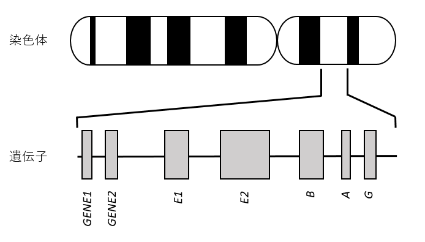
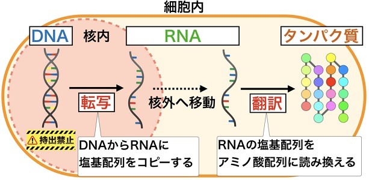
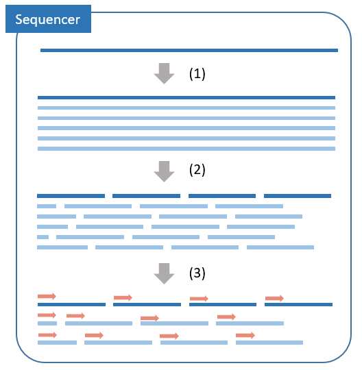
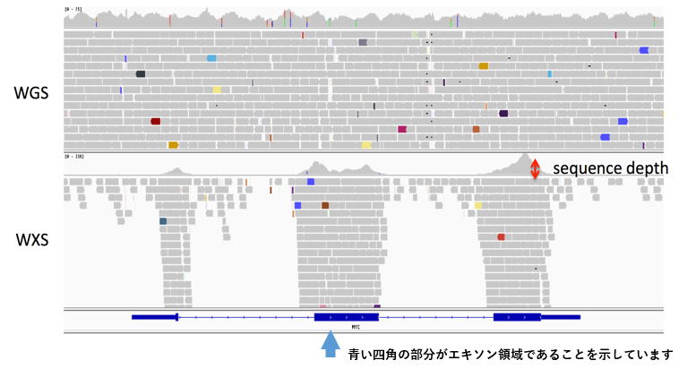
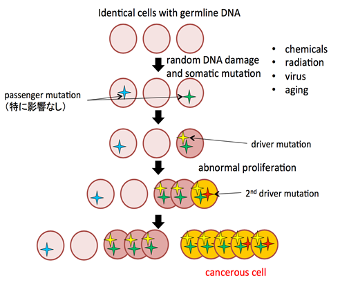
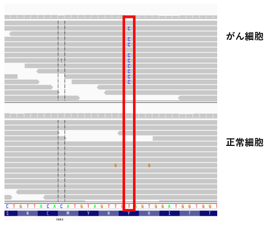
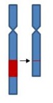
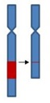
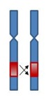

# がんゲノム解析入門

## 1. ゲノムは生命の設計図

ゲノムとは生命の設計図であり、精子や卵に含まれる親から子へ伝えられる遺伝情報に相当します。ゲノムの本体は DNA と呼ばれるひも状の物質で、A （アデニン）、G （グアニン）、T （チミン）、C （シトシン）の 4 種類の塩基 （文字） から成っています。この 4 文字の「ならび方」によってすべての生命の営みが決められています。ヒトゲノムは 30 億個の文字から成っています。[^1]

|図1.1 染色体とDNA|
|:-:|
||

ゲノム DNA の中で特に重要な領域は、タンパク質をコードする領域で、この領域は遺伝子と呼ばれています。
ヒトの場合、遺伝子は 2 万～ 3 万個あるとされています。

|図1.2 ゲノムと遺伝子|
|:-:|
||

遺伝子領域上のDNAはRNAに転写されたのち、アミノ酸配列に読み替えられて、我々の体を構成するタンパク質が生成されます。

|図1.3 転写と翻訳|
|:-:|
||

[^1]:http://hgc.jp/japanese/humangenome-j.html

## 2. どのようにして、ゲノムを読み取るか

現在、塩基配列を読み取るにはシーケンサーと呼ばれる配列を解読する専用の機械を使用することが一般的です。

現在広く用いられているシーケンサーは次世代シーケンサー（NGS）とよばれています。
従来法（サンガー法）が一つひとつ DNA 配列を決めていくのに対し、次世代シーケンサーは DNA 配列を断片化して、同時並行で配列を決定します。
従来法に比べて、圧倒的に低コストでのゲノムシーケンスが可能になりました。

### 2.1 DNAの採取

まず、動物の血液や体細胞、植物の組織などを採取します。

採取した組織から化学的処理を行い、DNAを抽出します。
RNAのシークエンスをする場合は、RNAの抽出を行います。


### 2.2 シーケンサーによる解読

シーケンサーではDNAを小さく断片化し、同時並行での配列を読み取りを行うことで、大量のDNA配列の決定を行います。
断片化されてシーケンサーされたDNAは一般的にショートリードと呼ばれます。

シーケンサーの精度は100%ではなく、読み取りエラーなども生じます。
そのために、同じ領域がショートリードに複数回カバーされ、エラーと本物のシグナルが区別できるように、シーケンスのデータ量を調整することが一般的です。
同じゲノム領域をカバーするショートリードの本数はシーケンスデプスと呼ばれています。



 - (1) DNA を複製します
 - (2) 複製した DNA を断片化します
 - (3) 断片化した DNA の塩基配列を解読します

### 2.3 アライメント

シーケンサーから生成されたショートリードは断片化されているために、ゲノム上の元の場所（どの染色体のどの箇所？）が分かりません。
そこで、各々のショートリードのゲノム上のポジションを決定する必要があります。この処理をアライメントといいます。

そのためには「元の場所」の基準が必要です。その基準をリファレンスゲノムといい、「国際参照ゲノム配列」という、2003年までに膨大な時間とコストをかけて解読したゲノムが使用されています。ヒトのゲノム配列の個人差は、0.1%程度と言われています。つまり大部分の箇所で一致するため、リファレンスゲノムをガイドにして元の場所を見つけることができます。[^4]

[^4]:https://www.megabank.tohoku.ac.jp/news/michi/6187


**シングルリードとペアリード**

次世代シークエンサーで解読できる塩基は、DNAの断片のうちごく一部であり通常、100～200塩基程度です。

ペアエンドモード（ペアリード）は二本鎖のそれぞれについて、端から150塩基ずつ解読します。塩基はペアになる組み合わせが決まっているので、片方を解読すればもう片方の塩基の並びも判明します。これにより、DNAの断片の両端が解読可能となります。

ペアを使用しない手法はペアリードに対してシングルエンドモード（シングルリード）といいます。


読み取ったゲノムの情報をシーケンスデータと呼びます。

## 3. シーケンスデータの種類

シークエンスデータには様々な種類がありますが、大きくは読み取り対象・領域の違いとファイルフォーマットの違いに分けられます。

ここでは読み取り対象・領域の違いについて記載します。

塩基配列を読み取る対象には大きく分けて DNA と RNA があります。

遺伝情報を調べる目的では DNA が多く利用されますが、どの遺伝子がどれだけ読み取られているか（発現しているか）を調査する等の目的で RNA も多く使用されています。

|名称|読み取り対象|サイズ|解説|
|:-----------|:---|:-----|:---|
|WGS         |DNA |数百 Gbyte|Whole Genome Sequence といいヒトのDNAをすべて読み取ったデータです。約 30 億文字あり、通常人一人当たり、圧縮した状態で数百 Gbyteと非常に大きなファイルです。|
|WXS         |DNA |数十 Gbyte|DNAには翻訳されて生体活動に使用されるエキソン領域と使用されないイントロン領域があります。データ量を抑えるためにエキソン領域だけを読み取ったデータです。exomeと呼ぶこともあります。|
|ターゲット  |DNA |数 Gbyte ～ 数十 Gbyte|がんの発生に関与しているなど、興味のある遺伝子だけを読み取ってさらにデータ量をおさえたデータをターゲットデータと呼びます。どれだけ多くの遺伝子を読み取っているかどうかでデータの大きさは異なります。|
|RNA         |RNA |数十 Gbyte|DNAではなくRNAの配列を読み取ったデータです。どの遺伝子が発現しているかを調査するなどの目的で使用されます。|

## 4. 読み取った配列のファイルフォーマット

読み取った配列情報をファイルに保存するには形式には様々なフォーマットがありますが、代表的なフォーマットは、FASTQ （ファストキュー）と、SAM（サム）BAM（バム）です。

### FASTQ [^2]

FASTQ は、シーケンサーが読み取ったリードの配列を保存したものです。
もとは、ATGCの文字を記述するだけの FASTA（ファスタ）というフォーマットがあり、それに加え、シーケンサーで読み取った各塩基のクオリティーのスコアを格納したものです。

リードを1本1本、記録しているため、数千万行から数億行の大きなサイズのファイルです。
テキストファイルですので、テキストエディタで開くと、文字が読めます。
（圧縮されている場合は、一度展開する必要があります。エディタによってはそのまま読めるものもあります。）

```Bash
$ head -n 8 _GRCh37/sample/dna/simulate_N_read1.fq
@11-1265791-1265931-0/1
ACCATGTCCACAGCCAGACCCTCCTCCACTCCAGAGACTGTCCACACCTCCACAGTGCTTACCACCACGGCCACCACAACCGGGGCCACCGGCTCTGTGG
+
>>;A?9AAABA<<@:>::>;<>9=AA5595>:>;>:>;<>9:76(E=;?683=?;9;7)E?A?<??A6;<::?;8609=?<??0;8=????>><9?????
@11-1263095-1263247-2/1
ACACAAGCACCCTTGGTACAGCCACCACGGGAGGCCCCACGACGCCTGCAGGCTCCACAGAACCCACTGTCCCAGGGGTGGCCACATCCACCCTTCCAAC
+
;>;:?A?A?67=A:>;<87768;>;;:6767;72>7;>5/4>:::@AA66==@??:A?8==9=@>:865>;?>9?8=<??8<??????><3:>;9?????
```

FASTQ は 4 行で 1 つのリードを表現します

 - 1行目：リードID
 - 2行目：塩基配列
 - 3行目：＋固定
 - 4行目：2行目に記述した配列のクオリティ


ファイルの拡張子は、.fastq, .fq などです。
圧縮されていれば、.fastq.gz, .fq.gz のようになります。（FASTA の場合は、.fasta, .fa, fa.gz など。）
また、_1.fq.gz, _2.fq.gz のように番号がついているものは、ペアエンドモードでシーケンスされた結果です。
この場合、1サンプルあたり、2つのFASTQファイルがあります。

### SAM [^2]

シーケンサーから出力されたリード(FASTQ) を、リファレンスとなる配列にマッピングした結果は、SAM（さむ）形式のファイルになります。
1本1本のリードが、ゲノム上のどこにマップされたかを示します。
FASTQ の中身も含むので、ファイルのサイズは数十ギガバイト (GB) と大きくなります。
ファイルの拡張子は、.sam です。

```Bash
$ samtools view _GRCh37/sample/dna/simulate_T.sam | head -n 2
11-2657290-2657453-30832        163     1       11225180        32      100M    =       11225339        259     AAACCCACAGCCAATATCAGACTGAATGAGCAAAAACTGGAAGCATTCCATTTGAAAACTGGCACAAGACAGGGATGCCCTCTCTCACCACTCCTATTCA        :>;<?A?A<<C9=<=A:;;&D;?;5<A:>:===55:@::>/9=9::?;>;A3:?:5864>9:>><<?><?:A;>9??=;:>:<<==?;09????9;?<>:    NM:i:3  MD:Z:19T8G20C50 AS:i:85 XS:i:90
11-2657290-2657453-30832        83      1       11225339        32      100M    =       11225180        -259    TAGGAAAAGAGGAAGTCAAATTGTCCCTGTTTGCAGATGACATGATTGTATATTTAGAAAACCCCGTCATCTCAGCCCAAAATCTCCTTAAGCTGATAAG        =7;>9=;?:;??:9??????=?=<;><;A??:;>;2269;=8;>>;?9>;??<=<;;?:>CD+/,,:9;=9>:A===AE.;>5==A?C,:88:6665>;>    NM:i:1  MD:Z:36G63      AS:i:95 XS:i:100
```

SAM ファイル中のアラインメントの部分はタブ区切りで、全部で 11 カラム以上からなり、それぞれのカラムは以下のようになっています。

 - QNAME: リードの名前
 - FLAG: アラインメント結果
 - RNAME: リファレンスの名前
 - POS: リファレンス上における、リードがマップされた開始位置。
 - CIGAR:
 - MAPQ: マッピングクオリティ
 - RNEXT: ペアエンドの場合、相手方のリード名（QNAME）。
 - PNEXT: ペアエンドの場合、相手方のマップされた開始位置。
 - TLEN:
 - SEQ: FASTQ の塩基配列データ
 - QUAL: FASTQ のクオリティデータ。


### BAM [^2]

BAM は、上記の SAM を圧縮したものです。データの中身は、SAMと同一のものです。
通常、マッピングした結果として提供されるのは、このBAMファイルです。
1サンプルにつき1個の BAM ファイルになります（ペアエンドでもマッピング後のファイルは1個）。
ファイルの拡張子は、.bam です。圧縮といっても、単純に gzip や、bzip2 で圧縮したわけではないため、専用のツール (samtools) を使って圧縮や展開を行います。
（よって、sam.gz や sam.bz2 ではありません。）

```
$ samtools view _GRCh37/sample/dna/simulate_T.bam | head -n 2
11-2657290-2657453-30832        163     1       11225180        32      100M    =       11225339        259     AAACCCACAGCCAATATCAGACTGAATGAGCAAAAACTGGAAGCATTCCATTTGAAAACTGGCACAAGACAGGGATGCCCTCTCTCACCACTCCTATTCA        :>;<?A?A<<C9=<=A:;;&D;?;5<A:>:===55:@::>/9=9::?;>;A3:?:5864>9:>><<?><?:A;>9??=;:>:<<==?;09????9;?<>:    NM:i:3  MD:Z:19T8G20C50 AS:i:85 XS:i:90
11-2657290-2657453-30832        83      1       11225339        32      100M    =       11225180        -259    TAGGAAAAGAGGAAGTCAAATTGTCCCTGTTTGCAGATGACATGATTGTATATTTAGAAAACCCCGTCATCTCAGCCCAAAATCTCCTTAAGCTGATAAG        =7;>9=;?:;??:9??????=?=<;><;A??:;>;2269;=8;>>;?9>;??<=<;;?:>CD+/,,:9;=9>:A===AE.;>5==A?C,:88:6665>;>    NM:i:1  MD:Z:36G63      AS:i:95 XS:i:100
```

### FASTQ / SAM / BAM のサイズ比較

ある WGX サンプルでサイズを比較した結果が以下の表になります。

シーケンサーが作成した FASTQ ファイルに対して、アライメント情報を付与した SAM ファイルは 1.5 倍ほどの大きさになり、SAM ファイルを圧縮した BAM ファイルは 3～5 分の一程度に圧縮されます。

|format|size|
|:-----|---:|
|FASTQ | 26G|
|SAM   | 34G|
|BAM   |9.3G|


### ゲノムブラウザ	

シーケンスデータはテキストデータもしくは圧縮されたデータのため、ゲノムブラウザという専用のツールを使って視覚化したほうが解釈が容易になります。

[IGVビューアー](http://software.broadinstitute.org/software/igv/) が広く利用されているゲノムブラウザの一つです。

以下はとあるサンプルの WGS と WXS を IGVビューアーで見た図です。
WGS の場合、全体に満遍なくシーケンスされているのに対して、WXS の場合、エキソン領域だけシーケンスされていることが読み取れます。

|図4.1 IGVビューアーでWGSとWXSを確認する|
|:-:|
||

[^2]:http://array.cell-innovator.com/?p=3014

## 5. がんはゲノムの病気である

がんはヒトのDNAの変異が原因で発生します。

ヒトは通常生活している中で化学物質、紫外線、ウイルスや加齢など、いろいろなストレスにさらされています。

それらは DNA に対し化学的な影響を与えますが、多くは passenger mutation とよばれ影響のない変異です。

しかし、まれにがん化や細胞の異常増殖の原因となる変異が発生することがあり、 driver mutation と呼ばれています。

現在、 driver mutation の検出や薬剤の開発など、研究が進められています。

|図5.1 がんの発生|
|:-:|
||

## 6. 様々なゲノム変異

ゲノムに起こる変異には様々なバリエーションがありますが、大きくは点変異と構造異常に分けられます。

 - 点変異は特定の場所に対し、文字置換や削除・挿入が発生しているような局所的な変異をいいます。
 - 構造変異は特定の場所が別の遺伝子と置き換わってしまうような大域的な変異を指します。

### 点変異

以下はがん細胞のゲノムと同一人物の正常細胞のゲノムを並べて比較した図です。

赤枠の個所が T から C に変わっていることが読み取れます。

|図6.1 点変異|
|:-:|
||

### 構造変異

代表的な構造異常を次に示します。

一般的にエラーとなる範囲がイントロン領域を含みますので、WGS のみで検出が可能です。

|変異のタイプ|イメージ図|解説|
|:--|:-:|:--|
|Duplication (重複)||ある領域が重複した状態です|
|Deletion (欠失)||ある領域が欠失した状態です|
|Inversion (逆位)||ある領域が上下逆転してしまう現象です|
|Translocation (転座)||染色体の一部または全部が他の染色体に結合した状態です|

## 7. 公共データベース

がんのゲノム解析は世界中で行われており、多くの情報が公開されています。
がんゲノム解析に関する公共データベースは次のようなものがあります。

### 変異データベース

どのようなゲノムの変異ががんの発生に関与しているかをまとめたデータベースです。
以下は世界的に広く知られている大規模なプロジェクトです。

 - [CIVIC](https://civicdb.org/home)
 - [oncoKB](http://oncokb.org/#/)
 - [COSMIC](https://cancer.sanger.ac.uk/cosmic)

### SNP データベース

**SNP（スニップ）とは**

ヒトのゲノムDNAの約30億個の塩基の並びは、全ての人間において同じではありません。
標準的な塩基配列と比べると、一塩基だけが違って多様性(多型)が生じていることがあり、これを Single Nucleotide Polymorphism (SNP) といいます。
SNPの大多数は、ヒトの個性であり、生命維持活動に影響をもたらすものではありません。
しかし、遺伝子や制御領域にある一部のSNPは、遺伝的な個人差を生じさせている可能性があります。
つまり、SNPは、基本的な体質、医薬品の効力や副作用などの個人差や、高血圧、糖尿病などの多因子性遺伝子疾患の発症の個人差などの指標になる可能性があり、SNPの解析により、個人別のテーラーメイド医療や予測医療への可能性が広がると期待されています。[^3]

[^3]:https://kotobank.jp/word/SNP-185393

## 出典

 - 1: [ヒトゲノム解析計画とは](http://hgc.jp/japanese/humangenome-j.html)
 - 2: [NGSデータ解析時のファイルのフォーマット (1)](http://array.cell-innovator.com/?p=3014)
 - 3: [コトバンク SNP](https://kotobank.jp/word/SNP-185393)
 - 4: [第4回 ToMMoではこうやってDNAを解読しています（後編：スーパーコンピュータ）](https://www.megabank.tohoku.ac.jp/news/michi/6187)
